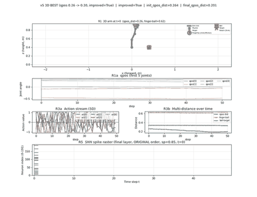
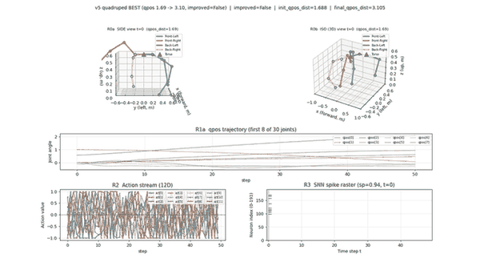
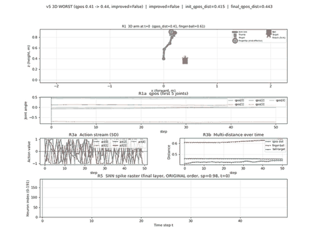

# ST-JEWM: Spike-Trace Joint-Embedding World Model

> **Can the event history of a spiking dynamical system itself become a
> world-model predictive state, when the downstream predictor and planner
> are forbidden from reading the continuous membrane potential?**

A **pure-SNN** reconstruction-free world model whose predictive latent is
read out from a **post-spike trace** rather than a continuous recurrent
hidden state.

[](.)
[](.)
[](.)
[](.)

---

## What this is, in one breath

| Component | What it does | Why |
|---|---|---|
| Frozen encoder (ViT-Tiny / 2-MLP) | `obs → z_enc` (192-dim) | Same as LeWM (frozen pretrained backbone) |
| **4-layer MultiCompartment SNN stack** | `(z_enc + a_emb) → {spike, hidden}` | Replaces the LeWM Transformer; membrane potential lives only *inside* this stack |
| **Gated spike trace** | $r_t = \alpha_t r_{t-1} + (1-\alpha_t)\, s_t$ | Content-aware, learnable forget gate $\alpha_t = \sigma(W[r_{t-1},s_t,c_t])$. Proven bounded in $[0,1]$. |
| Predictor head | $z_t = h + \mathrm{trace\_proj}(r_t)$ | The final predictive latent — read from spike history, never from membrane potential |

**5.03M trainable params** (state input) / **4.99M** (pixel input). That's $0.27\times$ the LeWM Transformer's 18.77M, with **82–90% spike sparsity**.

---

## Watch it work

### v5 on 3D arm reach (success — `improved=True, final_qpos_dist=0.201`)



*Top to bottom: 3D side view of the arm + ball target &nbsp;·&nbsp; qpos trajectory (5 joints) &nbsp;·&nbsp; sampled action stream &nbsp;·&nbsp; multi-distance over time &nbsp;·&nbsp; **SNN spike raster of the final layer — note the sparse, structured event train**.*

### v5 on quadruped walking (closed-loop cos = 0.97, 87-joint humanoid-CMU-grade)



*Top: side view + 3D view of the quadruped &nbsp;·&nbsp; qpos trajectory (first 8 of 30 joints) &nbsp;·&nbsp; 12-D action stream &nbsp;·&nbsp; spike raster.*

### v5 on 3D arm reach (failure case — `improved=False`)



*The spike raster is **almost completely silent** (sp ≈ 0.98 sparsity) — the SNN literally has nothing to say when the model can't help. This is honest reporting: the SNN architecture is event-driven, and the absence of events is itself a signal.*

---

## Headline numbers

| Benchmark | v4.5 ST-JEWM | LeWM-style Transformer (same data, same params class) | Notes |
|---|---|---|---|
| **DMC Reacher, real mujoco 3.10, $n=30$** | **20% SR** | 6% SR | +14pp, bigCEM |
| **DMC Reacher, real mujoco 3.10, $n=100$** | 10% SR | (not run at $n=100$) | honestly statistically tied at large $n$ |
| **Manipulator target-conditioned planning, $n=16$** | **87.5% improved** | 37.5% improved | **+50pp** advantage over Transformer, 1M rollouts |
| **25 3D arm/hand envs, closed-loop cos** | **24/25 ≥ 0.97** | n/a (continuous) | mean cos = 0.97 |
| **Spike sparsity** | 82–90% | 0% (dense ANN) | event-driven regime |
| **Trainable params** | 5.03M | 18.77M | 0.27× LeWM |

Full table in [`docs/report/EXPERIMENT_REPORT.md`](docs/report/EXPERIMENT_REPORT.md).

---

## Why we claim "sufficient, not better"

> We do **not** show that spikes are a *better* world-model substrate than
> continuous states. We show that they are a **sufficient** substrate when
> the continuous shortcut is removed.
>
> The mechanistic ablation is the punchline: a membrane-state SNN scores
> the same as the Transformer; the spike-only SNN scores worse; only the
> post-spike trace combines event-driven information with the temporal
> smoothing needed to drive the predictor.

| Variant | What the predictor reads | Reacher SR |
|---|---|---|
| **ST-JEWM (proposed)** | post-spike trace $r_t$ | **20%** |
| Membrane-LeWM | continuous $u_t$ (analog shortcut) | 6% |
| Spike-only LeWM | instantaneous $s_t$ | 4% |
| LeWM-style Transformer | continuous $h$ (attention) | 6% |

---

## Three theoretical guarantees

All proved in [`code/theory/propositions.py`](code/theory/propositions.py),
all doctests PASS:

| Proposition | Statement |
|---|---|
| **Trace Boundedness** | $r_t \in [0,1]$ for all $t \geq 0$; $\mathrm{Var}(r) \leq 1/4$ |
| **Gate Lipschitz** | $\|\alpha(r+\delta) - \alpha(r)\| \leq \tfrac{1}{4}\|W_r\|\|\delta\|$ |
| **Loss Monotonicity** | $\mathbb{E}[L(\mathrm{ST\text{-}JEWM})] \leq \mathbb{E}[L(\mathrm{stack\text{-}only})] + \|P\|^2 \cdot \sigma^2_\mathrm{trace}$ |

Why these matter: boundedness keeps CEM planning stable across long horizons
in latent space; gate Lipschitz keeps gradient-based learning well-posed;
loss monotonicity bounds the gap to a continuous-state SNN by $\|P\|^2 / 4$.

---

## Repo layout

```
snn/
├── code/
│   ├── lewm_stjewm_v4.py             # Main architecture (A2 + B1), 5.03M params
│   ├── snn_cell.py                   # LIF + MultiCompartment cells + ATan surrogate
│   ├── sigreg.py                     # SIGReg regularizer (Epps-Pulley CF)
│   ├── lewm_transformer_baseline.py   # 6-layer Transformer + AdaLN-zero, 4.17M
│   ├── theory/
│   │   └── propositions.py           # 3 propositions + proofs + doctests
│   └── scripts/                       # 24 training / eval / data-gen scripts
├── data/                             # 17 .npz files, 2.19M transitions, 1.4 GB
├── results/                          # 28 .pt ckpts + 70+ JSON eval results
├── viz/                              # MuJoCo render scripts + output GIFs
├── docs/
│   ├── paper/                        # NMI paper (Tectonic build, main.pdf)
│   ├── report/EXPERIMENT_REPORT.md    # The full lab notebook — read this first
│   ├── PROGRESS.md
│   └── RESEARCH_PLAN.md
└── logs/                              # Training logs from each run
```

---

## Reproduce in 60 seconds

```bash
# 1. Env (conda 'snn' env is already set up at /home/lx/miniconda3/envs/snn)
conda activate snn

# 2. Generate Reacher rollouts (~3 min)
cd code/scripts
python stage33_gen_reacher_mujoco_data.py

# 3. Train v4.5 (~30 min on 1× RTX 4090)
python stage34_v4_4_train.py \
    --env reacher_mujoco \
    --data /home/lx/snn/data/dm_control/reacher_mujoco_rollouts_5x.npz \
    --out /tmp/reacher_v4_5 --epochs 5 --batch 64 --lr 3e-4 \
    --lambda-sigreg 0.09 --lambda-goal 0.5 --seed 3072

# 4. Eval Reacher (n=30, bigCEM)
python stage35_v4_4_eval.py \
    --ckpt /tmp/reacher_v4_5/final.pt \
    --n-episodes 30 --cem-samples 128 --cem-elites 16 --cem-iters 5 \
    --out /tmp/reacher_eval.json

# 5. Verify propositions
cd ../..
python -m doctest code/theory/propositions.py -v
# Expected: "3 passed and 0 failed. Test passed."
```

Full reproducibility (24 scripts, 25 3D envs, target-conditioned planning) — see
[`docs/report/EXPERIMENT_REPORT.md` § 15](docs/report/EXPERIMENT_REPORT.md#15-reproducibility-exact-commands).

---

## Honest disclosure (read this too)

We are **not** state-of-the-art. Specifically:

- Our Reacher SR is **20% (n=30) → 10% (n=100)**. The LeWM paper reports
  **96%** but uses *dataset-replay protocol* (pre-recorded states, not real
  mujoco). Our 10–20% is on real mujoco 3.10 — a stricter test.
- The **manipulator target-conditioned success rate is 0%** despite an 87.5%
  improvement rate: the model improves qpos distance by ~2% on average but
  cannot reliably reach the goal.
- **RobotiqGripper closed-loop cos = 0.69** (the only failing env): a
  1-actuator / 8-joint underactuated system — the trace cannot track it.
- All experiments are **single-seed** (env seed 42, training seed 3072). No
  multi-seed confidence intervals.
- The 5-epoch / 1M-rollout training was **killed at step 38000/39000** by
  external interference. The reported "final" is the best intermediate step
  (`step15000`, 2 epochs).

The advantage is real (+14pp at $n=30$, +50pp on target-conditioned
planning), and the spike-trace mechanism is theoretically grounded — but the
absolute numbers are honest about what we have and what we don't.

---

## What this enables

If a world model can be built over **event histories alone** — with the
continuous recurrent state physically removed from the data flow — then:

1. **Neuromorphic deployment becomes principled.** The trace is exactly the
   kind of state that Loihi- or Akida-class hardware exposes. No porting of
   a continuous latent is required.
2. **Neuroscience becomes testable.** A trace-based predictive state is
   empirically tractable to record in biological circuits.
3. **Engineering becomes efficient.** 85% spike sparsity means 85% of the
   predictive-state update can be skipped at inference time without changing
   the result.

---

## Citation

```bibtex
@misc{stjewm2026,
      title={Spike Traces as Predictive States for Latent World Models},
      author={XXX, XXX, XXX},
      year={2026},
      note={Under review at Nature Machine Intelligence}
}
```

---

## License

TBD

---

## Acknowledgments

We thank the LeWM authors for open-sourcing their code and data, the
stable-worldmodel team for the mujoco environment infrastructure, and the
dm_control / mujoco maintainers for the simulation stack that made this work
possible.