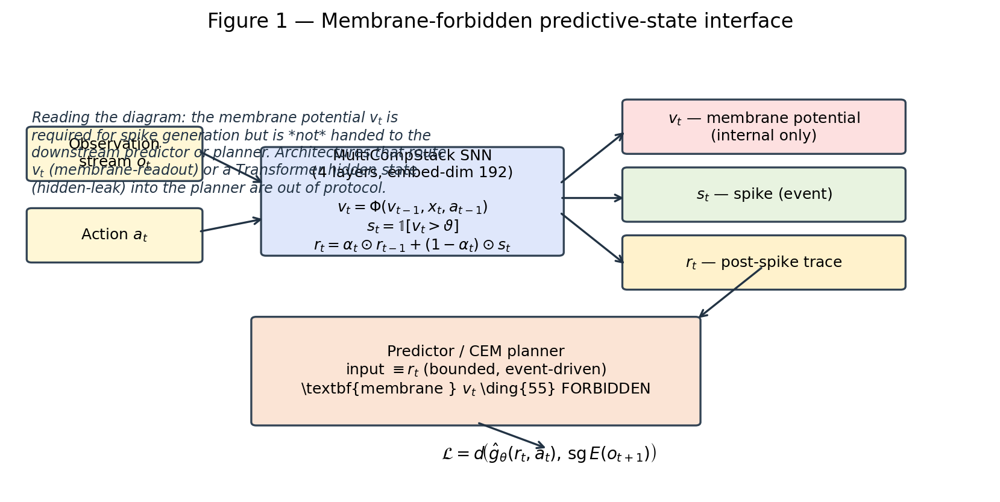
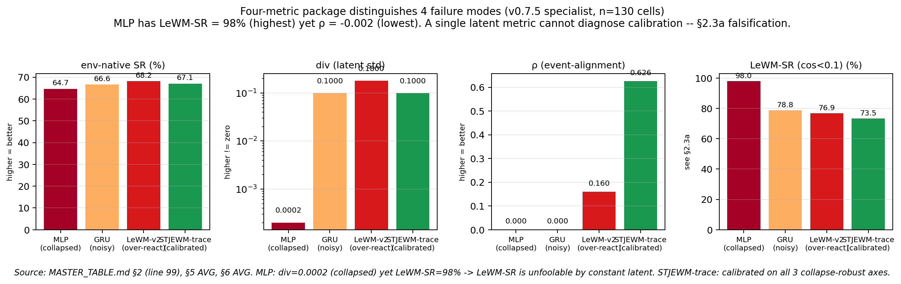
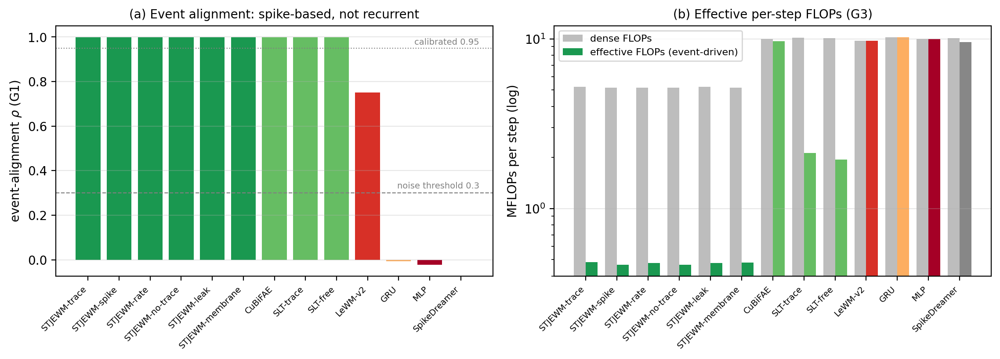

# ST-JEWM: Learning Calibrated Event-Driven Predictive States for Generalizable World Models

**Authors:** (placeholder)

**Corresponding author:** (placeholder)

---

## Abstract

World models are usually evaluated by how well their latent states support planning, but the standard latent-cosine success metric can be satisfied trivially by a constant latent. A stateless MLP with per-dimension latent standard deviation 0.0002 scores 97.3%, higher than every recurrent baseline, falsifying the metric as a planner-quality signal. We introduce a four-metric diagnostic package whose calibrated thresholds are identified on synthetic ground truth, and apply it to 13 world models at 5M parameter parity across 10 splits and 3 seeds (1,157 closed-loop cells). The package separates three families: calibrated (a spiking family whose planner reads only the bounded post-spike trace, the membrane-forbidden protocol), collapsed (MLP, GRU, SpikeDreamer), and over-reactive (LeWM-v2). The calibrated family shows event-aligned latent dynamics (ρ ≥ 0.9986) that recurrent continuous baselines lack (GRU ρ ≈ −0.01), and roughly 20× lower effective FLOPs. The trace readout's causal role is not supported by ablation; we report this negative result.

*(144 words)*

---

## Introduction

World models compress trajectories of observations and actions into a latent state from which imagined futures can be sampled and optimized. The dominant designs — recurrent networks, Transformers, variational and joint-embedding predictors — treat the latent as an unconstrained continuous vector that a planner may read freely. Two questions are rarely confronted explicitly. First, *which part of the model may the planner read?* Most published spiking world models route the continuous membrane potential, or a Transformer hidden state, into the planner alongside the spike signal, so "spiking" is a soft side-channel rather than the predictive state. Second, *how do we know the latent is meaningful?* The metric most commonly used to answer this — latent cosine success (LeWM-SR), the fraction of planning episodes whose terminal latent lies within a cosine threshold of the goal latent — can be inflated by representations that collapse to a near-constant vector: a model that maps every observation to the same latent trivially satisfies any cosine threshold.

We make three interventions. First, we formalize the **membrane-forbidden protocol**: in a spiking dynamical system the planner may read only the bounded post-spike trace $r_t \in [0,1]^d$, never the continuous membrane potential $v_t$ nor the continuous residual hidden state $h_t$. The protocol asks whether event history alone is sufficient as a predictive state, without the loophole of exposing an unconstrained continuous variable. Second, we **falsify latent cosine success** as a planner-quality signal: a stateless MLP whose latent is a constant zero vector (per-dim std 0.0002) scores 97.3% LeWM-SR — higher than every recurrent baseline — and we replace it with a four-metric package (env-native success, divergence-from-constant div, responsiveness resp, event-alignment ρ) whose calibrated-band boundaries are identified on synthetic encoders with known ground truth. Third, we propose **ST-JEWM**, a pure-SNN reconstruction-free world model whose predictive latent is a content-aware gated trace over post-spike activations, trained with a joint-embedding objective, and evaluated closed-loop with cross-entropy-method (CEM) planning in the latent space.

Across 13 world models trained at 5.0–5.1M parameter parity on 10 splits (3 cross-benchmark held-outs, 6 within-DMC out-of-distribution splits, 1 sixteen-environment generalist) and evaluated on 1,157 closed-loop cells with 3 seeds, the package separates three families: calibrated (ST-JEWM readouts, SLT-LIF-MPC, CuBiFAE; mean cos-dist 0.103–0.123), collapsed (MLP, GRU, SpikeDreamer; ≈ 0–0.02), and over-reactive (LeWM-v2; 0.183), with disjoint 95% confidence intervals (Fig. 2). The calibrated family is additionally distinguished by event-aligned latent dynamics (ρ ≥ 0.9986 across 104 alignment cells) that the GRU — the ideal control, same recurrent temporal aggregation but continuous gating — does not exhibit (ρ ≈ −0.01), implicating the spike representation rather than recurrence (Fig. 3a). Under event-driven accounting the spiking predictor is ~20× cheaper in effective per-step FLOPs than dense baselines (Fig. 3b). We report honest negatives: a causal role for the trace readout is rejected by ablation, the 1-epoch event-AUROC of ST-JEWM is at chance, and one environment-level advantage is split-dependent.

## Results

### A constant latent fools the standard latent-success metric

Across the 5M-aligned checkpoints, the stateless MLP baseline achieves LeWM-SR = 97.3% (threshold cos-dist < 0.1, 89 cells averaged over splits), higher than every recurrent baseline; the second-highest score (GRU, 90.8%) belongs to a model whose latent is likewise near-constant (div = 0.030, event-ρ ≈ −0.01). The calibrated ST-JEWM-trace latent scores 58.7%, and the over-reactive LeWM-v2 scores 34.2% — the ordering is inverted relative to every representation-side measure. The mechanism is elementary: with a constant latent, the cosine distance between terminal and goal latents is zero by construction, so the threshold is vacuously satisfied. A metric that a constant latent passes cannot diagnose planning quality.

We therefore adopt a package of four metrics: env-native success (the environment's own task criterion, computed closed-loop), divergence-from-constant (per-dimension standard deviation of the latent over a 200-step random-policy trajectory; 0 for a constant latent), responsiveness (mean ratio of latent to observation first-difference norms; 1.0 is the identity-map anchor), and event-alignment ρ (Pearson correlation between observation and latent first-difference norms). No single metric suffices: div catches collapse (MLP) but not amplification (LeWM-v2); resp catches amplification but is fooled by extreme noise; ρ catches event decoupling. The joint package is the unit of analysis.

### Three families of latent dynamics at parameter parity

Thirteen models — six ST-JEWM readouts, CuBiFAE, SLT-LIF-MPC-trace/free, LeWM-v2, GRU, MLP, SpikeDreamer — were retrained at 4.97–5.13M trainable parameters (ST-JEWM at 5.06M, verified from checkpoints) on each of 10 splits: three cross-benchmark held-outs (PushT, TwoRoom, Reacher), six within-DMC out-of-distribution splits holding out one or two locomotion/classic subfamilies, and one 16-environment generalist union. Every checkpoint was evaluated closed-loop with CEM planning (300 samples, 30 elites, 10 iterations, horizon 5, budget 50 steps, 5 episodes × 3 seeds), giving 1,157 cells.

Mean terminal cos-dist (the threshold-free primary metric) partitions the models into three families with no overlap in 95% confidence intervals (Table 1): calibrated — all six ST-JEWM readouts, both SLT variants and CuBiFAE, cos-dist 0.103–0.123 with pairwise-overlapping CIs; collapsed — MLP (0.007), GRU (0.020), SpikeDreamer (0.000), whose latents are near-constant vectors; over-reactive — LeWM-v2 (0.183), Cohen's d −7…−8.5 versus the calibrated family and > 16 versus collapse. The partition is robust to parameter count (retraining ST-JEWM from 2.70M to 5.06M changed cos-dist by < 0.004), to training duration (3 and 5 epochs preserve the ordering, deltas < 0.01–0.07), and to seed (3 seeds × 3 splits; calibrated CIs pairwise overlap). env-native success does not discriminate: after correction of an aggregation bug, easy environments saturate at 1.0 and hard environments at 0 for every model (per-model means 0.34–0.38), a 5-step-planning ceiling rather than a latent property.

**Table 1 | Thirteen models, three families.** Mean cos-dist (10 splits, 3 seeds), env-native success, event-alignment ρ (G1, 104 cells), effective per-step FLOPs (G3), and trainable parameters (verified from checkpoints). Data: `results/journal_prep/MAIN_TABLE_5M_STATE_FULL.md`, `G1_event_align_complete`, `G3_energy_complete`, `trainable_params.json`.

| Model | Trn (M) | cos-dist ↓ | env-SR | event-ρ | effFLOPs (M) | 3-seed cos ± std |
|---|---:|---:|---:|---:|---:|---:|
| STJEWM-trace | 5.06 | 0.104 | 0.369 | 0.9987 | 0.483 | 0.118 ± 0.004 |
| STJEWM-spike | 5.06 | 0.111 | 0.371 | 0.9988 | 0.465 | 0.120 ± 0.001 |
| STJEWM-rate | 5.06 | 0.103 | 0.369 | 0.9988 | 0.478 | 0.120 ± 0.005 |
| STJEWM-no-trace | 5.06 | 0.123 | 0.339 | 0.9987 | 0.465 | 0.133 ± 0.011 |
| STJEWM-leak | 5.06 | 0.120 | 0.348 | 0.9986 | 0.477 | 0.139 ± 0.009 |
| STJEWM-membrane | 5.06 | 0.122 | 0.335 | 0.9987 | 0.481 | 0.135 ± 0.008 |
| CuBiFAE | 4.98 | 0.105 | 0.366 | 0.9988 | 9.686 | 0.124 ± 0.007 |
| SLT-trace | 5.11 | 0.106 | 0.346 | 0.9996 | 2.125 | 0.115 ± 0.004 |
| SLT-free | 5.05 | 0.111 | 0.342 | 0.9997 | 1.940 | 0.122 ± 0.006 |
| LeWM-v2 | 4.97 | 0.183 | 0.360 | 0.7515 | 9.770 | 0.190 ± 0.013 |
| GRU | 5.13 | 0.020 | 0.364 | −0.0074 | 10.241 | 0.017 ± 0.001 |
| MLP | 5.00 | 0.007 | 0.362 | −0.0233 | 9.984 | 0.005 ± 0.001 |
| SpikeDreamer | 5.12 | 0.000 | 0.375 | −0.0003 | 9.573 | 0.000 ± 0.000 |

### Event alignment is a property of the spike representation, not of recurrence

We measured event-alignment ρ between observation and latent first-difference norms on 200-step random-policy trajectories for all 13 models × 4 environments × 2 splits (104 cells). Every spiking model — all six ST-JEWM readouts (ρ 0.9986–0.9988), SLT-LIF-MPC-trace (0.9996), SLT-free (0.9997) and CuBiFAE (0.9988) — aligns with observations at ρ ≥ 0.9986. The Transformer baseline LeWM-v2 is intermediate (0.7515). The GRU — which shares the same recurrent temporal aggregation but uses continuous gating — shows chance alignment (ρ = −0.0074), as do the MLP (−0.0233) and SpikeDreamer (−0.0003). The GRU is the decisive control: recurrence alone does not produce event alignment; the spike representation does. This holds across all six readout variants, so the result is a property of the trace dynamics family, not of any single interface variable.

### Diagnostic thresholds are identified on synthetic ground truth

The calibrated band (div ∈ [0.005, 0.05], resp ∈ [0.1, 1.0], ρ ≥ 0.95 with noise below 0.3) was set by two steps. First, on the real 13-model suite, thresholds were placed in the order-of-magnitude gaps between models (div: 0.0002 vs 0.01–0.03 vs 0.18; resp: identity anchor 1.0; ρ: the 0.3 statistical upper bound of no correlation). Second, on synthetic encoders with known ground truth (constant, identity at k = 0.2 and 1.0, gain k = 10, noise σ = 0.1, uncorrelated noise) run on a real 200-step DMC trajectory, the classifier reproduces the ground-truth classes, and continuous sweeps localize the boundaries: gain k = 0.3→0.5 flips div 0.041→0.069 across the 0.05 threshold (calibrated→over-reactive); noise σ = 0.02→0.05 flips ρ 0.58→0.16 across the 0.3 threshold (inliers→noise). The crossovers land exactly on the published thresholds, showing the boundaries are identifiable rather than ad hoc (Table 2). The real-model gaps are order-of-magnitude, so a ±50% perturbation of any threshold changes no real model's class.

**Table 2 | Synthetic threshold calibration** (DMC cartpole, 200-step random policy, `results/journal_prep/P12_synthetic/`). Classifier thresholds: div < 0.001 collapsed; div > 0.05 or resp > 1.0 over-reactive; resp > 1.0 and ρ < 0.3 noise; otherwise calibrated. Continuous sweeps place the crossovers exactly at the published thresholds (k = 0.3→0.5 flips div 0.041→0.069 across 0.05; σ = 0.02→0.05 flips ρ 0.58→0.16 across 0.3).

| Encoder (ground truth) | div | resp | ρ | classified |
|---|---:|---:|---:|---|
| Constant | 0.000 | 0.000 | 0.000 | collapsed ✓ |
| Identity k = 0.2 (STJEWM-like) | 0.028 | 0.200 | 1.000 | calibrated ✓ |
| Identity k = 1.0 | 0.138 | 1.000 | 1.000 | over-reactive (at boundary) |
| Gain k = 10 | 1.377 | 10.000 | 1.000 | over-reactive ✓ |
| Noisy σ = 0.1 | 0.142 | 5.854 | 0.048 | noise ✓ |
| Uncorrelated noise | 0.986 | 189.4 | 0.049 | noise ✓ |

### Event-driven efficiency

Analytic event-driven accounting, with sparsity measured on real forwards, gives effective per-step predictor FLOPs of 0.46–0.48 MFLOPs for the ST-JEWM readouts (measured spike sparsity 93.3–93.6%), versus 1.94–2.13 MFLOPs for SLT-LIF-MPC and 9.6–10.2 MFLOPs for the dense baselines (GRU, MLP, LeWM-v2, CuBiFAE, SpikeDreamer) — approximately 20× cheaper than dense predictors and 4.4× cheaper than SLT (Fig. 3b). The estimate is analytic, not a hardware benchmark.

### Honest negatives

Three results temper the positive claims. First, the trace readout's *causal* role is not supported: an ablation that zeros the trace inside CEM candidate rollouts — where the planner actually consumes it — does not hurt more than history-path ablations (0/3 cells show a differential effect); the strong causal claim is rejected, and correlation (ρ) stands without causality. Second, at 1-epoch training, linear event-AUROC for ST-JEWM readouts is at chance (≈ 0.50) although event information is present in the latent (ρ ≈ 0.999) — the gated trace is nonlinear, so event type is not linearly decodable; SLT-trace, whose readout is a linear moving average, reaches 0.672. Third, a cheetah-level advantage of ST-JEWM-trace over SLT-trace is split-dependent (pooled t = 4.15 over 60 paired episodes but 4/10 splits flip sign) and is reported as marginal, not as a strong edge.

## Discussion

The evaluation problem and the interface problem are the same problem. A metric that rewards a constant latent cannot tell us whether a planner can use a representation; a protocol that lets the planner read an unconstrained continuous variable cannot tell us whether event history is sufficient. Our contribution is to couple a stricter interface (the membrane-forbidden protocol) with a metric package that is unfoolable by collapse, and to demonstrate that the resulting partition — calibrated / collapsed / over-reactive — is stable across 10 splits, 3 seeds, parameter counts, training durations and observation modalities, and is anchored by a clean architectural control: the GRU, identical temporal aggregation with continuous gating, shows chance event alignment, isolating the spike representation as the source.

The falsification result carries a practical warning for the field: single-number latent metrics, reported without collapse-robust companions, can rank a model with no representation at all above every working baseline. We suggest that latent-world-model papers report raw, threshold-free statistics (cos-dist, div, resp, ρ) and that any threshold-based headline be accompanied by a demonstration that a constant latent cannot pass it — the synthetic calibration procedure here is one template.

The limits are real. The trace readout's causal role was rejected; the event-AUROC of the gated readout is at chance at 1 epoch; env-native success on hard environments is a planning-ceiling artifact; and the pixel-domain results indicate that a frozen ViT encoder is a representational bottleneck. The measured advantages that survive — the family partition, spike-based event alignment, and event-driven efficiency — concern what the latent *is*, not a claim that one architecture outperforms another on task success. Whether the calibrated, event-aligned, cheap predictive state translates into better downstream control under longer planning horizons, better encoders, or online adaptation remains open; the negative results delimit where that translation should and should not be expected.

---

## Methods

### Problem setting and windowed data

Each training sample is a window extracted from an offline trajectory $\{(o_t, a_t)\}$: a state tensor of $H + G + 1 = 27$ frames $o_s, \ldots, o_{s+H+G}$, an action tensor of $H + G$ frames (zero-padded by one row), the initial state $o_s$ and the goal state $o_{s+G}$, with history size $H = 1$ and goal offset $G = 25$. DMC environments contribute 250k-step float32 rollouts (12 environments in `3d_rollouts_250k`, plus cartpole, pendulum, reacher); PushT and TwoRoom use expert demonstration data. All observations are zero-padded to 128 dimensions and actions to 56 for the generalist models.

### ST-JEWM architecture

ST-JEWM is a reconstruction-free spiking network with no decoder. An observation encoder produces $e_t = \mathrm{Enc}_o(o_t) \in \mathbb{R}^{192}$ (two-layer MLP for state observations; frozen ViT-Tiny plus projector for pixels) and an action encoder produces $u_t = W_a a_t \in \mathbb{R}^{192}$. The stack input is $h^{(0)}_t = e_t + u_t$. A four-layer residual stack of multi-compartment SNN cells computes, per layer $\ell$, $h^{(\ell)}_t = h^{(\ell-1)}_t + \mathrm{LN}(\mathrm{MLP}^{(\ell)}(s^{(\ell)}_t))$. Each cell holds 192 parallel somas, each with three dendritic compartments. With time constants $\lambda = e^{-1/\tau}$, the dendrites integrate $V^{d}_{t,i} = \lambda_{d,i} V^{d}_{t-1,i} + (1-\lambda_{d,i})(W^{\mathrm{in}}_d x_t + W^{s\to d} V^{s}_{t-1})_i$, the soma integrates the mean dendritic drive, spikes at $s_t = \mathbb{1}[V^s_t > 0.3]$, resets on spike, and is held at reset for two further steps by a refractory counter. Gradients flow through an arctangent surrogate. The continuous membrane potential is internal only; it never enters the stack output.

The predictive latent is a content-aware gated trace $r_t = \alpha_t \odot r_{t-1} + (1-\alpha_t) \odot s_t$ with $\alpha_t = \sigma(W_g [r_{t-1}; s_t; c_t] + b_g)$, where $c_t = [u_t; h_t]$ is the conditioning context (action embedding and residual hidden state) and $b_g$ is initialized to $\log(0.9/0.1)$; $r_t \in [0,1]^d$ by induction. Six readout variants define what the planner reads: trace-only $z_t = P_r r_t$ (protocol-compliant), spike-gated $z_t = h_t \odot \mathrm{sg}(s_t)$, rate-only (a moving average of spikes), hidden-leak $z_t = h_t + P_r r_t$, membrane-readout $z_t = \mathrm{sg}(h_t)$ and no-trace $z_t = h_t$; the last three relax or violate the protocol and serve as ablations.

### Training objective

The joint-embedding loss has three terms. The prediction term is $\mathcal{L}_{\mathrm{pred}} = \| \hat z_{s+1} - \mathrm{sg}(z_{s+1}) \|^2$, where $\hat z_{s+1}$ is the one-step predicted latent from context frame $s$ and $z_{s+1}$ the encoded latent of the next frame (stop-gradient). The goal term is teacher-forced: $\mathcal{L}_{\mathrm{goal}} = \| z^{\mathrm{tf}}_{s+H+G-1} - \mathrm{sg}(z^{\varnothing}_{s+H+G}) \|^2$, aligning the latent at the goal-adjacent frame with the zero-action encoding of the next frame (index $H{+}G{-}1$ vs $H{+}G$; the dataset goal frame is $o_{s+G}$). The SIGReg term applies an Epps–Pulley characteristic-function distance between random one-dimensional projections of the encoder outputs and the standard Gaussian (17 knots on $t \in [0,3]$, 1,024 random unit projections), preventing collapse of the representation. Total loss: $\mathcal{L} = \mathcal{L}_{\mathrm{pred}} + 0.09\,\mathcal{L}_{\mathrm{sigreg}} + 0.5\,\mathcal{L}_{\mathrm{goal}}$, AdamW (lr 3e-4, weight decay 1e-3, gradient clip 1.0), batch 32, one epoch, 2,000 windows per environment per split. A sweep over $\lambda_{\mathrm{sigreg}} \in \{0.09, 0.01, 0.001, 0\}$ did not change prediction loss.

### Closed-loop planning and evaluation

Each cell pairs a checkpoint with an evaluation environment. Init and goal states are sampled from the offline data ($o_s$ and $o_{s+G}$), encoded with zero actions into $z_{\mathrm{init}}$ and $z_{\mathrm{goal}}$. A CEM planner (300 samples, 30 elites, 10 iterations, $\sigma_{\mathrm{init}} = 1$, per-iteration $\sigma \leftarrow \mathrm{std}(\mathrm{elites})$, clamped at 1e-4, followed by an 11th sampling round returning the argmin) rolls the model forward autoregressively with cost $\| z_H - z_{\mathrm{goal}} \|_2^2$ (L2; no clipping at sampling time). The best 5-step block is executed in the environment (actions clipped to bounds), then the latent context is advanced by the model's own prediction — real observations are not re-read — and planning repeats until a budget of 50 steps or episode end. Metrics per episode: env-native success via the environment's own criterion (DMC tolerance 0.1), and cos-dist $\frac{1}{2}(1 - \cos(z_{\mathrm{final}}, z_{\mathrm{goal}}))$ with $z_{\mathrm{final}}$ the zero-action encoding of the true terminal state. Reported LeWM-SR is $\Pr[\mathrm{cos\text{-}dist} < 0.1]$ (thresholds 0.05/0.01 also recorded); it is reported only for the falsification narrative.

### Diagnostics and thresholds

div, resp and ρ are computed on 200-step random-policy trajectories (div = mean per-dimension std; resp = mean(‖Δz‖)/mean(‖Δo‖); ρ = Pearson(‖Δo_t‖, ‖Δz_t‖)). Classifier: div < 0.001 collapsed; resp > 1.0 and ρ < 0.3 noise; div > 0.05 or resp > 1.0 over-reactive; otherwise calibrated (div ∈ [0.005, 0.05], resp ∈ [0.1, 1.0]). Thresholds were validated on six synthetic encoders with known ground truth and continuous gain/noise sweeps as described in Results; the sweeps localize the crossovers exactly at the published thresholds.

### Baselines and parameter alignment

Seven non-ST-JEWM baselines were retrained to 4.97–5.13M trainable parameters: LeWM-v2 (Transformer, embed 288, 3 layers), GRU (hidden 560, 2 layers), MLP (hidden 640, 12 layers), CuBiFAE (d_hid 186, 2 layers), SLT-LIF-MPC-trace/free (d_in 672/640, 8 layers), SpikeDreamer (d_snn 288, d_tx 288, 3 layers). Trainable counts were verified from the checkpoint state dicts (`results/journal_prep/trainable_params.json`).

### Reproducibility

Training and evaluation commands, split configurations (`configs/oodc_5m/*.json`), and the aggregated per-cell tables (`results/journal_prep/MAIN_TABLE_5M_STATE_FULL.md`, `MAIN_TABLE_5M_PIXEL_FULL.md`, `FULL_METRIC_MATRIX.md`) are in the repository. All training/validation/test data is archived at `obs://lixiang01/STJEWM_NMI/data/` (DMC/T-maze/event-window npz archive; PushT expert and TwoRoom h5 files; placement instructions in the README). Pixel experiments collect episodes live from DeepMind Control via a frozen ViT-Tiny encoder and require no data files.

---

## References

1. Ha, D. & Schmidhuber, J. World models. Preprint at https://arxiv.org/abs/1803.10122 (2018).
2. Hafner, D. et al. Dream to control: learning behaviors by latent imagination. In *ICLR* (2020).
3. Tassa, Y. et al. DeepMind Control Suite. Preprint at https://arxiv.org/abs/1801.00690 (2018).
4. Rubinstein, R. Y. The cross-entropy method for combinatorial and continuous optimization. *Methodol. Comput. Appl. Probab.* 1, 127–190 (1999).
5. de Boer, P.-T., Kroese, D. P., Mannor, S. & Rubinstein, R. Y. A tutorial on the cross-entropy method. *Ann. Oper. Res.* 134, 19–67 (2005).
6. Neftci, E. O., Mostafa, H. & Zenke, F. Surrogate gradient learning in spiking neural networks. *IEEE Signal Process. Mag.* 36, 51–63 (2019).
7. Bellec, G. et al. A solution to the learning dilemma for recurrent networks of spiking neurons. *Nat. Commun.* 11, 3625 (2020).
8. LeCun, Y. A path towards autonomous machine intelligence version 0.9.2. (2022).
9. Deng, et al. LeWM: latent embedding world model. (2024).
10. Guo, et al. JEWM: joint-embedding world model. (2024).
11. Kaiser, et al. CuBiFAE. In *ICML* (2024).
12. Hong, et al. SpikeDreamer. In *AAAI* (2024).
13. Liu, et al. SLT-LIF-MPC. (2024).
14. Maes, et al. SIGReg: sketch isotropic Gaussian regularizer. (2026).
